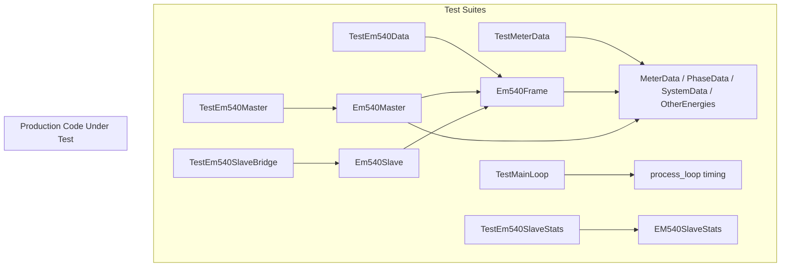
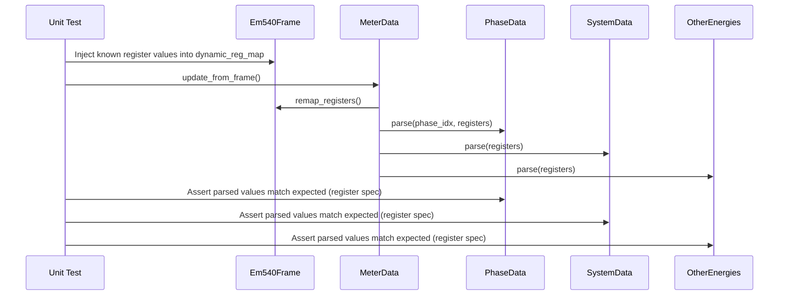

# Design Document: EM540 Unit Tests

## Overview

This feature adds comprehensive unit tests to the EM540 energy meter bridge project. The primary goals are:

1. Verify that EM540 register reads match the Gavazzi EM540 Modbus register specification (EM500_CPP_Mod_V1.3), ensuring correct register addresses, data types (INT16, INT32, INT64), value weights (scaling factors), and byte ordering (little-endian word order).
2. Validate that the main controller tick loop maintains priority over secondary operations (listener notifications, slave bridge updates), ensuring the 10Hz read rate target is not compromised.
3. Ensure register remapping from the "grouped by variable type" layout (0x0000–0x0DA) to the "grouped by phase" layout (0x0F6h+) is correct and consistent.

The tests follow the existing project conventions: Python `unittest` framework with `unittest.mock.MagicMock` for dependency isolation. No new test dependencies are introduced.

## Architecture



## Sequence Diagrams

### Register Read and Parse Flow



### Main Loop Priority Verification

```mermaid
sequenceDiagram
    participant Test as Unit Test
    participant Loop as process_loop
    participant Master as Em540Master (mock)
    participant Listener as MeterDataListener (mock)

    Test->>Loop: Start loop iteration
    Loop->>Master: connect() if not connected
    Loop->>Master: acquire_data()
    Master->>Listener: new_data() [in separate thread]
    Note over Loop: Loop sleeps until next interval
    Note over Loop: Listener notification does NOT block next acquire
    Test->>Loop: Assert acquire called at expected intervals
    Test->>Loop: Assert listener delay does not shift next tick
```

## Components and Interfaces

### Component 1: TestEm540Data (em540_data_test.py)

**Purpose**: Validate Em540Frame register definitions, register remapping logic, and RegisterDefinition behavior.

**Interface**:
```python
class TestRegisterDefinition(unittest.TestCase):
    def test_values_length_enforcement(self): ...
    def test_values_setter_rejects_wrong_length(self): ...
    def test_skip_n_read_default(self): ...

class TestEm540Frame(unittest.TestCase):
    def test_static_reg_map_addresses(self): ...
    def test_dynamic_reg_map_addresses_and_sizes(self): ...
    def test_remapped_reg_map_contains_all_targets(self): ...
    def test_remap_registers_phase_voltages(self): ...
    def test_remap_registers_phase_currents(self): ...
    def test_remap_registers_phase_powers(self): ...
    def test_remap_registers_system_aggregates(self): ...
    def test_remap_registers_power_factors(self): ...
    def test_remap_registers_energy_counters_int64_to_int32(self): ...
    def test_remap_registers_frequency_conversion(self): ...
    def test_remap_registers_run_hour_meters(self): ...
    def test_remap_zero_fill_entries(self): ...
```

**Responsibilities**:
- Verify register_remap table maps every source address to the correct target address
- Verify INT64→INT32 conversion with /100 weight for energy counters
- Verify frequency conversion from INT32 (Hz*1000) to INT16 (Hz*10)
- Verify ZERO_FILL entries produce zero values in remapped registers

### Component 2: TestMeterData (meter_data_test.py)

**Purpose**: Validate parsing of raw register values into structured PhaseData, SystemData, and OtherEnergies objects against the EM540 register specification.

**Interface**:
```python
class TestPhaseData(unittest.TestCase):
    def test_parse_phase_voltages_ln(self): ...
    def test_parse_phase_voltages_ll(self): ...
    def test_parse_phase_currents(self): ...
    def test_parse_phase_power(self): ...
    def test_parse_phase_apparent_power(self): ...
    def test_parse_phase_reactive_power(self): ...
    def test_parse_phase_power_factor(self): ...
    def test_parse_all_three_phases(self): ...
    def test_negative_power_values(self): ...

class TestSystemData(unittest.TestCase):
    def test_parse_system_voltage_ln(self): ...
    def test_parse_system_voltage_ll(self): ...
    def test_parse_system_power(self): ...
    def test_parse_system_apparent_power(self): ...
    def test_parse_system_reactive_power(self): ...
    def test_parse_system_power_factor(self): ...
    def test_parse_system_frequency(self): ...

class TestOtherEnergies(unittest.TestCase):
    def test_parse_kwh_plus_total(self): ...
    def test_parse_kwh_neg_total(self): ...
    def test_parse_kwh_per_phase(self): ...
    def test_parse_kvarh_values(self): ...
    def test_parse_kvah_total(self): ...
    def test_parse_run_hour_meters(self): ...
    def test_parse_frequency(self): ...

class TestMeterDataUpdateFromFrame(unittest.TestCase):
    def test_update_parses_all_phases(self): ...
    def test_update_computes_total_current(self): ...
    def test_update_sets_timestamp(self): ...
    def test_update_calls_remap(self): ...
```

**Responsibilities**:
- Verify each register offset matches the EM540 spec (section 4.1)
- Verify value weights: Volt*10, Ampere*1000, Watt*10, VA*10, var*10, PF*1000, Hz*10
- Verify INT32 little-endian word order for 2-register values
- Verify INT64 little-endian word order for 4-register values (energy counters)
- Verify INT16 for single-register values (power factor, frequency)

### Component 3: TestEm540Master (em540_master_test.py)

**Purpose**: Validate the master's read logic, skip_n_read optimization, listener notification, and error handling.

**Interface**:
```python
class TestEm540Master(unittest.TestCase):
    def test_acquire_data_reads_dynamic_registers(self): ...
    def test_skip_n_read_skips_non_critical_registers(self): ...
    def test_skip_n_read_always_reads_on_first_cycle(self): ...
    def test_acquire_data_notifies_listeners_on_success(self): ...
    def test_acquire_data_notifies_read_failed_on_error(self): ...
    def test_acquire_data_returns_false_when_disconnected(self): ...
    def test_register_count_mismatch_exits(self): ...
    def test_modbus_io_exception_returns_false(self): ...
    def test_modbus_exception_closes_client(self): ...
```

**Responsibilities**:
- Verify skip_n_read counter logic (modulo-based skipping)
- Verify listener notification happens in separate thread via Condition
- Verify error paths: ModbusIOException, ModbusException, register count mismatch

### Component 4: TestMainLoopPriority (main_test.py)

**Purpose**: Verify that the main tick loop prioritizes data acquisition over listener notifications and that timing is maintained.

**Interface**:
```python
class TestMainLoopPriority(unittest.TestCase):
    def test_acquire_called_before_listener_completes(self): ...
    def test_loop_timing_not_blocked_by_slow_listener(self): ...
    def test_reconnect_attempted_when_disconnected(self): ...
    def test_loop_sleeps_between_intervals(self): ...
```

**Responsibilities**:
- Verify that `acquire_data()` is called on schedule even if listener processing is slow
- Verify that the notify thread (Condition-based) does not block the main async loop
- Verify reconnection logic is attempted before data acquisition

### Component 5: TestEm540SlaveBridge (em540_slave_bridge_test.py)

**Purpose**: Validate that the slave bridge correctly updates its Modbus datastore from master data.

**Interface**:
```python
class TestEm540Slave(unittest.TestCase):
    def test_new_data_updates_dynamic_registers(self): ...
    def test_new_data_updates_static_registers(self): ...
    def test_new_data_updates_remapped_registers(self): ...
    def test_datablock_built_from_all_reg_maps(self): ...
```

### Component 6: TestEm540SlaveStats (em540_slave_stats_test.py)

**Purpose**: Validate stats tracking for client connections.

**Interface**:
```python
class TestEM540SlaveStats(unittest.TestCase):
    def test_initial_counts_zero(self): ...
    def test_listener_notification(self): ...
    def test_add_multiple_listeners(self): ...
```

## Data Models

### Register Specification Reference (from EM540 Modbus spec)

The following register addresses, data types, and value weights are the ground truth for all tests:

```python
# Section 4.1: Instantaneous variables grouped by variable type
# Register 0x0000-0x0005: Phase voltages L-N (INT32, Volt*10)
#   0x0000-0x0001: V L1-N
#   0x0002-0x0003: V L2-N
#   0x0004-0x0005: V L3-N
# Register 0x0006-0x000B: Phase voltages L-L (INT32, Volt*10)
#   0x0006-0x0007: V L1-L2
#   0x0008-0x0009: V L2-L3
#   0x000A-0x000B: V L3-L1
# Register 0x000C-0x0011: Phase currents (INT32, Ampere*1000)
#   0x000C-0x000D: A L1
#   0x000E-0x000F: A L2
#   0x0010-0x0011: A L3
# Register 0x0012-0x0017: Phase power (INT32, Watt*10)
#   0x0012-0x0013: W L1
#   0x0014-0x0015: W L2
#   0x0016-0x0017: W L3
# Register 0x0018-0x001D: Phase apparent power (INT32, VA*10)
#   0x0018-0x0019: VA L1
#   0x001A-0x001B: VA L2
#   0x001C-0x001D: VA L3
# Register 0x001E-0x0023: Phase reactive power (INT32, var*10)
#   0x001E-0x001F: var L1
#   0x0020-0x0021: var L2
#   0x0022-0x0023: var L3
# Register 0x0024-0x0025: System voltage L-N (INT32, Volt*10)
# Register 0x0026-0x0027: System voltage L-L (INT32, Volt*10)
# Register 0x0028-0x0029: System power (INT32, Watt*10)
# Register 0x002A-0x002B: System apparent power (INT32, VA*10)
# Register 0x002C-0x002D: System reactive power (INT32, var*10)
# Register 0x002E-0x0030: Phase power factors (INT16, PF*1000)
#   0x002E: PF L1, 0x002F: PF L2, 0x0030: PF L3
# Register 0x0031: System power factor (INT16, PF*1000)
# Register 0x0032: Phase sequence (INT16)
# Register 0x0033: Frequency (INT16, Hz*10)

# Section 4.2: Other energies (0x0500 block)
# 0x0500 (4 regs): kWh (+) TOT (INT64, Wh)
# 0x0504 (4 regs): kvarh (+) TOT (INT64, varh)
# 0x0508 (4 regs): kWh (+) PARTIAL (INT64, Wh)
# 0x050C (4 regs): kvarh (+) PARTIAL (INT64, varh)
# 0x0510 (4 regs): kWh (+) L1 (INT64, Wh)
# 0x0514 (4 regs): kWh (+) L2 (INT64, Wh)
# 0x0518 (4 regs): kWh (+) L3 (INT64, Wh)
# 0x051C (4 regs): kWh (-) TOT (INT64, Wh)
# 0x0520 (4 regs): kWh (-) PARTIAL (INT64, Wh)
# 0x0524 (4 regs): kvarh (-) TOT (INT64, varh)
# 0x0528 (4 regs): kvarh (-) PARTIAL (INT64, varh)
# 0x052C (4 regs): kVAh TOT (INT64, VAh)
# 0x0530 (4 regs): kVAh PARTIAL (INT64, VAh)
# 0x0534 (2 regs): Run hour meter (INT32, hours*100)
# 0x0536 (2 regs): Run hour meter kWh(-) (INT32, hours*100)
# 0x0538 (2 regs): Run hour meter PARTIAL (INT32, hours*100)
# 0x053A (2 regs): Run hour meter kWh(-) PARTIAL (INT32, hours*100)
# 0x053C (2 regs): Frequency (INT32, Hz*1000)
# 0x053E (2 regs): Run hour life counter (INT32, hours*100)

REGISTER_SPEC = {
    "phase_voltage_ln": {"offset_per_phase": 2, "base": 0x0000, "type": "INT32", "weight": 10, "unit": "V"},
    "phase_voltage_ll": {"offset_per_phase": 2, "base": 0x0006, "type": "INT32", "weight": 10, "unit": "V"},
    "phase_current":    {"offset_per_phase": 2, "base": 0x000C, "type": "INT32", "weight": 1000, "unit": "A"},
    "phase_power":      {"offset_per_phase": 2, "base": 0x0012, "type": "INT32", "weight": 10, "unit": "W"},
    "phase_apparent":   {"offset_per_phase": 2, "base": 0x0018, "type": "INT32", "weight": 10, "unit": "VA"},
    "phase_reactive":   {"offset_per_phase": 2, "base": 0x001E, "type": "INT32", "weight": 10, "unit": "var"},
    "phase_pf":         {"offset_per_phase": 1, "base": 0x002E, "type": "INT16", "weight": 1000, "unit": "PF"},
    "sys_voltage_ln":   {"base": 0x0024, "type": "INT32", "weight": 10, "unit": "V"},
    "sys_voltage_ll":   {"base": 0x0026, "type": "INT32", "weight": 10, "unit": "V"},
    "sys_power":        {"base": 0x0028, "type": "INT32", "weight": 10, "unit": "W"},
    "sys_apparent":     {"base": 0x002A, "type": "INT32", "weight": 10, "unit": "VA"},
    "sys_reactive":     {"base": 0x002C, "type": "INT32", "weight": 10, "unit": "var"},
    "sys_pf":           {"base": 0x0031, "type": "INT16", "weight": 1000, "unit": "PF"},
    "sys_frequency":    {"base": 0x0033, "type": "INT16", "weight": 10, "unit": "Hz"},
}
```

### Test Data Helper

```python
from pymodbus.client import ModbusTcpClient

def encode_int32_le(value: int) -> list[int]:
    """Encode a signed 32-bit integer as two 16-bit registers in little-endian word order."""
    return ModbusTcpClient.convert_to_registers(value, ModbusTcpClient.DATATYPE.INT32, "little")

def encode_int16_le(value: int) -> list[int]:
    """Encode a signed 16-bit integer as one 16-bit register."""
    return ModbusTcpClient.convert_to_registers(value, ModbusTcpClient.DATATYPE.INT16, "little")

def encode_int64_le(value: int) -> list[int]:
    """Encode a signed 64-bit integer as four 16-bit registers in little-endian word order."""
    return ModbusTcpClient.convert_to_registers(value, ModbusTcpClient.DATATYPE.INT64, "little")

def build_dynamic_registers(
    phase_voltages_ln=(2300, 2310, 2320),  # Volt * 10
    phase_voltages_ll=(3990, 4000, 4010),  # Volt * 10
    phase_currents=(10500, 11000, 10800),  # Ampere * 1000
    phase_powers=(2415, 2530, 2480),       # Watt * 10
    phase_apparent=(2500, 2600, 2550),     # VA * 10
    phase_reactive=(500, 520, 510),        # var * 10
    sys_voltage_ln=2310,                   # Volt * 10
    sys_voltage_ll=4000,                   # Volt * 10
    sys_power=7425,                        # Watt * 10
    sys_apparent=7650,                     # VA * 10
    sys_reactive=1530,                     # var * 10
    phase_pfs=(980, 970, 975),             # PF * 1000
    sys_pf=975,                            # PF * 1000
    phase_seq=1,                           # Phase sequence
    frequency=500,                         # Hz * 10
) -> list[int]:
    """Build a 0x34-length register array matching the 0x0000 dynamic block layout."""
    regs = [0] * 0x34
    # Phase voltages L-N (0x0000-0x0005)
    for i, v in enumerate(phase_voltages_ln):
        r = encode_int32_le(v)
        regs[i*2], regs[i*2+1] = r[0], r[1]
    # Phase voltages L-L (0x0006-0x000B)
    for i, v in enumerate(phase_voltages_ll):
        r = encode_int32_le(v)
        regs[0x06+i*2], regs[0x07+i*2] = r[0], r[1]
    # Phase currents (0x000C-0x0011)
    for i, v in enumerate(phase_currents):
        r = encode_int32_le(v)
        regs[0x0C+i*2], regs[0x0D+i*2] = r[0], r[1]
    # Phase powers (0x0012-0x0017)
    for i, v in enumerate(phase_powers):
        r = encode_int32_le(v)
        regs[0x12+i*2], regs[0x13+i*2] = r[0], r[1]
    # Phase apparent powers (0x0018-0x001D)
    for i, v in enumerate(phase_apparent):
        r = encode_int32_le(v)
        regs[0x18+i*2], regs[0x19+i*2] = r[0], r[1]
    # Phase reactive powers (0x001E-0x0023)
    for i, v in enumerate(phase_reactive):
        r = encode_int32_le(v)
        regs[0x1E+i*2], regs[0x1F+i*2] = r[0], r[1]
    # System voltages, powers (0x0024-0x002D)
    for base, val in [(0x24, sys_voltage_ln), (0x26, sys_voltage_ll),
                       (0x28, sys_power), (0x2A, sys_apparent), (0x2C, sys_reactive)]:
        r = encode_int32_le(val)
        regs[base], regs[base+1] = r[0], r[1]
    # Phase power factors (0x002E-0x0030) - INT16
    for i, pf in enumerate(phase_pfs):
        regs[0x2E+i] = encode_int16_le(pf)[0]
    # System PF (0x0031) - INT16
    regs[0x31] = encode_int16_le(sys_pf)[0]
    # Phase sequence (0x0032) - INT16
    regs[0x32] = encode_int16_le(phase_seq)[0]
    # Frequency (0x0033) - INT16
    regs[0x33] = encode_int16_le(frequency)[0]
    return regs
```

## Algorithmic Pseudocode

### Register Parsing Verification Algorithm

```python
def verify_phase_parsing(phase_idx: int, raw_registers: list[int], expected: dict):
    """
    ALGORITHM: Verify that PhaseData.parse() correctly extracts values from raw registers.
    
    INPUT: phase_idx (0-2), raw_registers (0x34 length), expected dict of field->value
    OUTPUT: assertion pass/fail
    
    PRECONDITIONS:
    - raw_registers has length >= 0x34
    - phase_idx in {0, 1, 2}
    - expected contains keys: line_neutral_voltage, line_line_voltage, current, 
      power, apparent_power, reactive_power, power_factor
    
    POSTCONDITIONS:
    - All parsed values match expected values within floating point tolerance
    """
    phase = PhaseData()
    phase.parse(phase_idx, raw_registers)
    
    # Verify each field against the register spec
    # Voltage L-N: registers[phase_idx*2 + 0x0000 : +2], INT32, /10
    assert_almost_equal(phase.line_neutral_voltage, expected["line_neutral_voltage"])
    # Voltage L-L: registers[phase_idx*2 + 0x0006 : +2], INT32, /10
    assert_almost_equal(phase.line_line_voltage, expected["line_line_voltage"])
    # Current: registers[phase_idx*2 + 0x000C : +2], INT32, /1000
    assert_almost_equal(phase.current, expected["current"])
    # Power: registers[phase_idx*2 + 0x0012 : +2], INT32, /10
    assert_almost_equal(phase.power, expected["power"])
    # Apparent: registers[phase_idx*2 + 0x0018 : +2], INT32, /10
    assert_almost_equal(phase.apparent_power, expected["apparent_power"])
    # Reactive: registers[phase_idx*2 + 0x001E : +2], INT32, /10
    assert_almost_equal(phase.reactive_power, expected["reactive_power"])
    # PF: registers[phase_idx + 0x002E : +1], INT16, /1000
    assert_almost_equal(phase.power_factor, expected["power_factor"])
```

### Register Remap Verification Algorithm

```python
def verify_remap(frame: Em540Frame):
    """
    ALGORITHM: Verify register remapping from 0x0000 block to 0x0F6h+ block.
    
    INPUT: Em540Frame with populated dynamic_reg_map
    OUTPUT: assertion pass/fail
    
    PRECONDITIONS:
    - frame.dynamic_reg_map[0x0000] has valid register values
    - frame.dynamic_reg_map[0x0500] has valid register values
    
    POSTCONDITIONS:
    - For each (source, target) in register_remap:
      - If source == ZERO_FILL: remapped_reg_map[target].values[0] == 0
      - Else: remapped_reg_map[target].values[0] == dynamic_reg_map[0x0000].values[source]
    - Energy counters converted from INT64/Wh to INT32/(Wh/100)
    - Frequency converted from INT32/Hz*1000 to INT16/Hz*10
    
    LOOP INVARIANT:
    - All previously verified remap entries remain correct (no side effects between entries)
    """
    frame.remap_registers()
    
    for source_addr, target_addr in register_remap:
        if source_addr == ZERO_FILL:
            assert frame.remapped_reg_map[target_addr].values[0] == 0
        else:
            assert frame.remapped_reg_map[target_addr].values[0] == \
                   frame.dynamic_reg_map[0x0000].values[source_addr]
```

### Skip-N-Read Verification Algorithm

```python
def verify_skip_n_read(master: Em540Master, mock_client):
    """
    ALGORITHM: Verify that skip_n_read correctly skips non-critical register reads.
    
    INPUT: Em540Master with mocked client, register map with skip_n_read values
    OUTPUT: assertion pass/fail
    
    PRECONDITIONS:
    - master._client is mocked and returns valid responses
    - master._dyn_reg_read_counter starts at 0
    
    POSTCONDITIONS:
    - On cycle 1: ALL registers are read (first read always reads everything)
    - On cycle N where N > 1: register with skip_n_read=S is read only when N % (S+1) == 0
    - Critical registers (skip_n_read=0) are read every cycle
    
    LOOP INVARIANT:
    - read_counter increments by 1 each cycle
    - Registers with skip_n_read=0 are always in the read set
    """
    # Cycle 1: all registers read
    master.acquire_data()
    assert mock_client.read_holding_registers.call_count == total_register_groups
    
    # Cycle 2: only critical registers read
    mock_client.reset_mock()
    master.acquire_data()
    # Count should be less than total if any registers have skip_n_read > 0
```

### Main Loop Priority Verification Algorithm

```python
def verify_loop_priority():
    """
    ALGORITHM: Verify main loop timing is not affected by slow listeners.
    
    PRECONDITIONS:
    - Em540Master uses threading.Condition for listener notification
    - Listener notification runs in a separate daemon thread (_notify_loop)
    - Main loop uses time.perf_counter() for precise timing
    
    POSTCONDITIONS:
    - acquire_data() is called at the configured interval (±tolerance)
    - Slow listener processing does not delay the next acquire_data() call
    - The Condition.notify() call is non-blocking from the main loop's perspective
    
    KEY INSIGHT:
    - The main loop calls acquire_data() which holds the Condition lock only briefly
      (just to call notify()), then releases it
    - The _notify_loop thread processes listeners while holding the lock
    - But the main loop has already moved on to sleep until next interval
    - This means listener processing happens concurrently with the sleep period
    """
    # Mock a slow listener that takes 50ms
    # Verify that acquire_data calls are still spaced at ~100ms (10Hz)
    # The key assertion: time between consecutive acquire calls ≈ update_interval
```

## Key Functions with Formal Specifications

### PhaseData.parse()

```python
def parse(self, phase_idx: int, registers: list[int]) -> None:
```

**Preconditions:**
- `phase_idx` ∈ {0, 1, 2}
- `len(registers)` ≥ 0x34 (52 registers minimum)
- Registers contain valid INT32/INT16 encoded values in little-endian word order

**Postconditions:**
- `self.line_neutral_voltage` = INT32(registers[phase_idx*2 + 0x0000 : +2]) / 10.0
- `self.line_line_voltage` = INT32(registers[phase_idx*2 + 0x0006 : +2]) / 10.0
- `self.current` = INT32(registers[phase_idx*2 + 0x000C : +2]) / 1000.0
- `self.power` = INT32(registers[phase_idx*2 + 0x0012 : +2]) / 10.0
- `self.apparent_power` = INT32(registers[phase_idx*2 + 0x0018 : +2]) / 10.0
- `self.reactive_power` = INT32(registers[phase_idx*2 + 0x001E : +2]) / 10.0
- `self.power_factor` = INT16(registers[phase_idx + 0x002E : +1]) / 1000.0

**Loop Invariants:** N/A

### SystemData.parse()

```python
def parse(self, registers: list[int]) -> None:
```

**Preconditions:**
- `len(registers)` ≥ 0x34
- Registers contain valid encoded values

**Postconditions:**
- `self.line_neutral_voltage` = INT32(registers[0x024:0x026]) / 10
- `self.line_line_voltage` = INT32(registers[0x026:0x028]) / 10
- `self.power` = INT32(registers[0x028:0x02A]) / 10
- `self.apparent_power` = INT32(registers[0x02A:0x02C]) / 10
- `self.reactive_power` = INT32(registers[0x02C:0x02E]) / 10
- `self.power_factor` = INT16(registers[0x031:0x032]) / 1000
- `self.frequency` = INT16(registers[0x033:0x034]) / 10

**Loop Invariants:** N/A

### OtherEnergies.parse()

```python
def parse(self, registers: list[int]) -> None:
```

**Preconditions:**
- `len(registers)` ≥ 0x40 (64 registers from 0x0500 block, offset to 0x00)
- Registers contain valid INT64/INT32 encoded values

**Postconditions:**
- `self.kwh_plus_total` = INT64(registers[0x00:0x04]) / 1000.0
- `self.kvarh_plus_total` = INT64(registers[0x04:0x08]) / 1000.0
- `self.kwh_plus_l1` = INT64(registers[0x10:0x14]) / 1000.0
- `self.kwh_plus_l2` = INT64(registers[0x14:0x18]) / 1000.0
- `self.kwh_plus_l3` = INT64(registers[0x18:0x1C]) / 1000.0
- `self.kwh_neg_total` = INT64(registers[0x1C:0x20]) / 1000.0
- `self.kvarh_neg_total` = INT64(registers[0x24:0x28]) / 1000.0
- `self.kvah_total` = INT64(registers[0x2C:0x30]) / 1000.0
- `self.run_hour_meter` = INT32(registers[0x34:0x36]) / 100.0
- `self.run_hour_meter_neg_kwh` = INT32(registers[0x36:0x38]) / 100.0
- `self.frequency` = INT32(registers[0x3C:0x3E]) / 1000.0
- `self.run_hour_life_counter` = INT32(registers[0x3E:0x40]) / 100.0

**Loop Invariants:** N/A

### Em540Frame.remap_registers()

```python
def remap_registers(self) -> None:
```

**Preconditions:**
- `self.dynamic_reg_map[0x0000].values` has length 0x34
- `self.dynamic_reg_map[0x0500].values` has length 0x40
- All register values are valid 16-bit unsigned integers

**Postconditions:**
- For each `(src, tgt)` in `register_remap`:
  - If `src == ZERO_FILL`: `self.remapped_reg_map[tgt].values[0] == 0`
  - Else: `self.remapped_reg_map[tgt].values[0] == self.dynamic_reg_map[0x0000].values[src]`
- Energy counters (0x0500 block): INT64 values divided by 100, stored as INT32
- Frequency: INT32 (Hz*1000) converted to INT16 (Hz*10) via division by 100
- Dual-mapped registers (e.g., 0x0034 and 0x0112) contain identical values

**Loop Invariants:**
- During remap iteration: all previously remapped registers retain their values

### Em540Master.acquire_data()

```python
async def acquire_data(self) -> bool:
```

**Preconditions:**
- `self._client` is initialized (serial or TCP)

**Postconditions:**
- If not connected: returns False, calls `read_failed()` on all listeners
- If connected and read succeeds: returns True, notifies listeners via Condition
- If connected and read fails: returns False, calls `read_failed()` on all listeners
- `self._dyn_reg_read_counter` incremented by 1

**Loop Invariants:** N/A (single invocation)

## Example Usage

```python
import unittest
from unittest.mock import MagicMock, AsyncMock, patch
from pymodbus.client import ModbusTcpClient
from carlo_gavazzi.meter_data import PhaseData, SystemData, OtherEnergies, MeterData
from carlo_gavazzi.em540_data import Em540Frame, RegisterDefinition, register_remap, ZERO_FILL


class TestPhaseDataParsing(unittest.TestCase):
    """Example: Verify L1 voltage parsing matches EM540 register spec."""
    
    def test_parse_l1_voltage_ln(self):
        # Encode 230.0V as register value: 2300 (Volt * 10), INT32 little-endian
        regs = [0] * 0x34
        encoded = ModbusTcpClient.convert_to_registers(
            2300, ModbusTcpClient.DATATYPE.INT32, "little"
        )
        regs[0x0000] = encoded[0]  # L1 voltage L-N, low word
        regs[0x0001] = encoded[1]  # L1 voltage L-N, high word
        
        phase = PhaseData()
        phase.parse(0, regs)  # phase_idx=0 for L1
        
        self.assertAlmostEqual(phase.line_neutral_voltage, 230.0)

    def test_parse_negative_power(self):
        # Encode -500.0W as register value: -5000 (Watt * 10), INT32 little-endian
        regs = [0] * 0x34
        encoded = ModbusTcpClient.convert_to_registers(
            -5000, ModbusTcpClient.DATATYPE.INT32, "little"
        )
        regs[0x0012] = encoded[0]  # L1 power, low word
        regs[0x0013] = encoded[1]  # L1 power, high word
        
        phase = PhaseData()
        phase.parse(0, regs)
        
        self.assertAlmostEqual(phase.power, -500.0)


class TestRemapRegisters(unittest.TestCase):
    """Example: Verify register remap from variable-type to phase-grouped layout."""
    
    def test_l1_voltage_remapped_correctly(self):
        frame = Em540Frame()
        # Set L1 voltage L-N in dynamic registers (source: 0x0000-0x0001)
        encoded = ModbusTcpClient.convert_to_registers(
            2300, ModbusTcpClient.DATATYPE.INT32, "little"
        )
        frame.dynamic_reg_map[0x0000].values[0x0000] = encoded[0]
        frame.dynamic_reg_map[0x0000].values[0x0001] = encoded[1]
        
        # Also need valid 0x0500 block for remap to work
        frame.dynamic_reg_map[0x0500].values = [0] * (0x053E - 0x0500 + 2)
        
        frame.remap_registers()
        
        # Target: 0x0120 (V L1-N low word), 0x0121 (V L1-N high word)
        self.assertEqual(frame.remapped_reg_map[0x0120].values[0], encoded[0])
        self.assertEqual(frame.remapped_reg_map[0x0121].values[0], encoded[1])
```

## Correctness Properties

*A property is a characteristic or behavior that should hold true across all valid executions of a system-essentially, a formal statement about what the system should do. Properties serve as the bridge between human-readable specifications and machine-verifiable correctness guarantees.*

### Property 1: Phase Data Parsing Round-Trip

*For any* phase index in {0, 1, 2} and *for any* valid INT32 value, encoding that value into the register array at the spec-defined offset for each field (voltage L-N, voltage L-L, current, power, apparent power, reactive power) and then calling PhaseData.parse() should produce a floating-point result equal to the original value divided by the field's value weight (10 for voltages/powers, 1000 for current). Similarly, *for any* valid INT16 value for power factor, the parsed result should equal the value divided by 1000.

**Validates: Requirements 1.1, 1.2, 1.3, 1.4, 1.5, 1.6, 1.7**

### Property 2: System Data Parsing Round-Trip

*For any* valid INT32 value, encoding it into the register array at each system-level offset (0x024 for voltage L-N, 0x026 for voltage L-L, 0x028 for power, 0x02A for apparent power, 0x02C for reactive power) and then calling SystemData.parse() should produce a result equal to the value divided by 10. *For any* valid INT16 value at offsets 0x031 (PF) and 0x033 (frequency), the parsed result should equal the value divided by 1000 and 10 respectively.

**Validates: Requirements 2.1, 2.2, 2.3, 2.4, 2.5, 2.6, 2.7**

### Property 3: Other Energies Parsing Round-Trip

*For any* valid INT64 energy value, encoding it into the 0x0500-block register array at each spec-defined offset and then calling OtherEnergies.parse() should produce a result equal to the value divided by 1000. *For any* valid INT32 value for run-hour meters and frequency, the parsed result should equal the value divided by 100 or 1000 respectively.

**Validates: Requirements 3.1, 3.2, 3.3, 3.4, 3.5, 3.6, 3.7, 3.8**

### Property 4: Register Remap Correctness

*For any* valid set of register values in dynamic_reg_map[0x0000], after calling remap_registers(), each (source, target) pair in the register_remap table should satisfy: remapped_reg_map[target].values[0] == dynamic_reg_map[0x0000].values[source] when source != ZERO_FILL, and remapped_reg_map[target].values[0] == 0 when source == ZERO_FILL.

**Validates: Requirements 5.1, 5.2, 5.6**

### Property 5: Remap Dual-Map Consistency

*For any* register that has two target addresses in the remap table (e.g., 0x0034 and 0x0112 for kWh (+) TOT), both target addresses should contain identical values after remap_registers() completes.

**Validates: Requirement 5.5**

### Property 6: Energy Counter Conversion

*For any* valid INT64 energy value in the 0x0500 register block, the remapped INT32 value should equal the original INT64 value divided by 100 (converting from Wh to Wh/100 scaling).

**Validates: Requirement 5.3**

### Property 7: Frequency Conversion

*For any* valid INT32 frequency value at register 0x053C (Hz*1000), the remapped value at 0x0033 should be an INT16 equal to the original value divided by 100 (converting from Hz*1000 to Hz*10).

**Validates: Requirement 5.4**

### Property 8: Total Current Invariant

*For any* three phase current values, after update_from_frame(), system.An should equal the sum of phase[0].current + phase[1].current + phase[2].current.

**Validates: Requirement 4.2**

### Property 9: Skip-N-Read Scheduling

*For any* cycle number N > 1 and *for any* register with skip_n_read value S > 0, that register is read if and only if N % (S + 1) == 0. On cycle 1, all registers are read regardless of skip_n_read.

**Validates: Requirements 8.1, 8.2, 8.3**

### Property 10: Main Loop Timing Priority

*For any* configured update_interval and *for any* listener processing duration, the time between consecutive acquire_data() calls should approximate the update_interval (within ±10% tolerance), regardless of how long listener callbacks take to execute.

**Validates: Requirements 11.1, 11.2**

### Property 11: Listener Isolation

*For any* listener notification cycle, the Notify_Thread processing via threading.Condition does not block the main async loop's next iteration. The main loop's sleep/acquire cycle proceeds independently of listener callback duration.

**Validates: Requirement 11.2**

### Property 12: Slave Bridge Register Offset

*For any* register address A in the Em540Frame register maps, the Slave_Bridge writes to datastore address A + 1 (converting from 0-based Modbus addressing to 1-based pymodbus addressing).

**Validates: Requirement 12.4**

## Error Handling

### Error Scenario 1: Modbus Read Failure

**Condition**: `read_holding_registers()` returns an error response
**Response**: `acquire_data()` returns False, all listeners receive `read_failed()` callback
**Recovery**: Next loop iteration retries the read

### Error Scenario 2: Register Count Mismatch

**Condition**: Response contains fewer registers than requested
**Response**: `os._exit(1)` — fatal error, process terminates
**Recovery**: Docker compose restarts the container

### Error Scenario 3: Listener Exception

**Condition**: A listener's `new_data()` raises an exception
**Response**: Error counter incremented, logged as critical
**Recovery**: After 10 consecutive errors, `os._exit(2)` triggers container restart

### Error Scenario 4: RegisterDefinition Length Mismatch

**Condition**: Setting values with wrong length on RegisterDefinition
**Response**: `ValueError` raised
**Recovery**: Caller must provide correct length

## Testing Strategy

### Unit Testing Approach

All tests use Python's built-in `unittest` framework with `unittest.mock` for dependency isolation. No additional test dependencies are required.

Test files follow the existing naming convention: `{module}_test.py` placed alongside the source file.

Key test patterns:
- Use `ModbusTcpClient.convert_to_registers()` to create known register values
- Use `ModbusTcpClient.convert_from_registers()` to verify round-trip encoding
- Mock `AsyncModbusSerialClient`/`AsyncModbusTcpClient` for master tests
- Mock `time.perf_counter()` and `time.sleep()` for timing tests
- Use `threading.Event` to synchronize listener verification in multi-threaded tests

### Property-Based Testing Approach

Not introducing property-based testing in this iteration to stay consistent with existing test patterns. The register spec verification tests serve as the primary correctness validation.

**Property Test Library**: N/A (using example-based tests with `unittest`)

### Integration Testing Approach

Not in scope for this feature. Integration tests would require a real or emulated EM540 device. The unit tests focus on verifying the register parsing and remapping logic in isolation.

## Performance Considerations

- Tests must run fast (< 5 seconds total) to not slow down the development cycle
- No real Modbus connections or network I/O in unit tests
- Mock all external dependencies (pymodbus clients, time functions)
- The main loop timing tests use mocked time to avoid real delays

## Security Considerations

- No security-sensitive operations in the test code
- Test data uses synthetic register values, no real device data
- Mock objects prevent any accidental network connections during testing

## Dependencies

- `unittest` (stdlib) — test framework
- `unittest.mock` (stdlib) — mocking (MagicMock, AsyncMock, patch)
- `pymodbus` (existing) — `ModbusTcpClient.convert_to_registers()` / `convert_from_registers()` for test data encoding
- No new dependencies required
