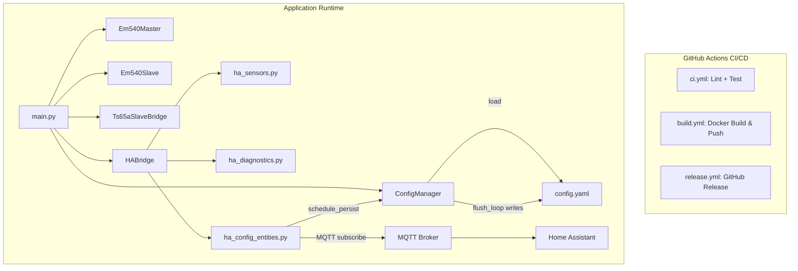
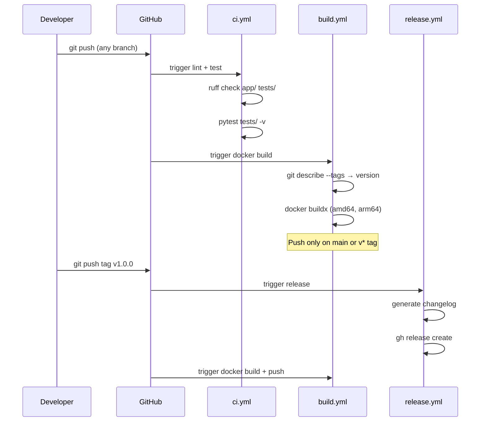
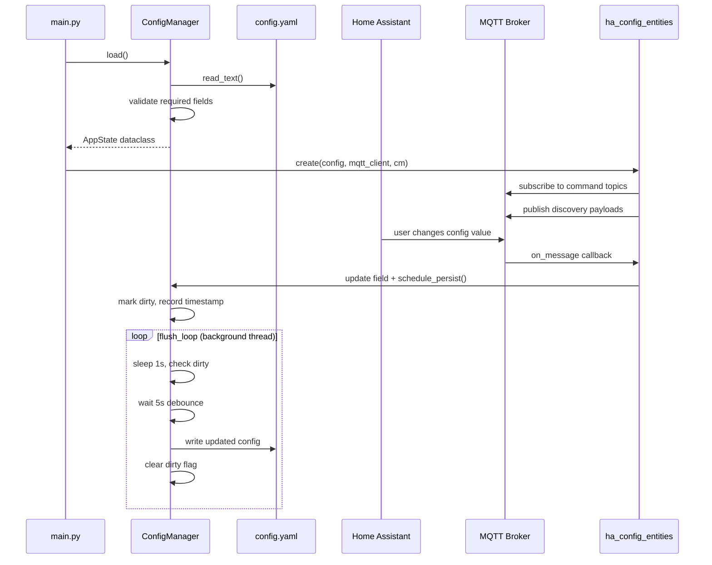

# Design Document: Project Reorganisation

## Overview

This project reorganisation aligns the em540-bridge project with the patterns established in the gw-charger-controller reference repository. The work covers three areas: (1) migrating CI/CD to GitHub Actions with ruff-based linting, pytest testing, Docker multi-arch builds, and automated releases; (2) replacing the read-only pyconfigparser with a read/write ConfigManager that supports debounced persistence to YAML; and (3) exposing all configuration items to Home Assistant as editable entities via MQTT discovery, so settings can be changed at runtime from the HA UI.

The existing synchronous paho-mqtt architecture is preserved. The ConfigManager uses a background thread (not asyncio) for its flush loop, consistent with the project's threading model. All existing functionality (Modbus bridging, HA sensors, diagnostics) remains unchanged.

## Architecture



## Sequence Diagrams

### CI/CD Pipeline



### Config Load and Runtime Update



## Components and Interfaces

### Component 1: GitHub Actions Workflows

**Purpose**: Automate linting, testing, Docker image building, and release creation.

**Files**:
- `.github/workflows/ci.yml` — Lint with ruff, test with pytest
- `.github/workflows/build.yml` — Multi-arch Docker build & push to DockerHub
- `.github/workflows/release.yml` — Auto-create GitHub Release on tag push

**Responsibilities**:
- Run `ruff check` on all Python source and test files
- Run `pytest tests/ -v --tb=short` (and discover `*_test.py` files in subdirectories)
- Build `linux/amd64` and `linux/arm64` Docker images
- Push images on main branch or version tags
- Generate changelog from git log for releases

### Component 2: Makefile (Updated)

**Purpose**: Local development commands aligned with CI.

**Interface**:
```makefile
lint:        # ruff check + ruff format --check
format:      # ruff format (auto-fix)
test:        # pytest tests/ and *_test.py discovery
build:       # docker buildx build
run:         # docker compose up
```

**Responsibilities**:
- Replace black/flake8/isort with ruff
- Add format target for auto-formatting
- Keep existing build/run targets functional

### Component 3: ConfigManager

**Purpose**: Load config from YAML, validate, expose as dataclass, support runtime writes with debounced persistence.

**Interface**:
```python
class ConfigManager:
    def __init__(self, path: str) -> None: ...
    def load(self) -> AppState: ...
    def schedule_persist(self) -> None: ...
    def start_flush_loop(self) -> None: ...
    def stop(self) -> None: ...

@dataclass
class AppState:
    # All fields from config-default.yaml, with defaults
    ...
```

**Responsibilities**:
- Read YAML file and populate AppState dataclass
- Validate required fields exist
- Debounced write-back: mark dirty, wait 5s, then write PERSISTED_FIELDS to YAML
- Thread-safe (flush loop runs in a daemon thread)
- Preserve YAML comments where possible (use PyYAML safe_dump)

### Component 4: HA Config Entities (ha_config_entities.py)

**Purpose**: Expose configuration items as editable Home Assistant entities via MQTT discovery.

**Interface**:
```python
class HAConfigEntities:
    def __init__(self, state: AppState, mqtt_client, config_manager: ConfigManager) -> None: ...
    def advertise(self) -> list[tuple[str, str]]: ...
    def subscribe(self) -> None: ...
```

**Responsibilities**:
- Publish MQTT discovery payloads for each config field (number, select, switch, text entities)
- Subscribe to command topics for each entity
- On command received: update AppState field, call `config_manager.schedule_persist()`
- Publish current state on connect and after changes

## Data Models

### AppState Dataclass

```python
from dataclasses import dataclass, field

@dataclass
class Em540MasterConfig:
    mode: str = "serial"
    baudrate: int = 9600
    parity: str = "N"
    bytesize: int = 8
    stopbits: int = 1
    serial_port: str = "/dev/ttyUSB0"
    host: str = "192.168.102.240"
    port: int = 8899
    slave_id: int = 1
    update_interval: float = 0.1
    timeout: float = 0.15
    retries: int = 0
    log_level: str = "INFO"

@dataclass
class Em540SlaveConfig:
    host: str = "0.0.0.0"
    rtu_port: int = 5002
    tcp_port: int = 5001
    slave_id: int = 1
    update_timeout: float = 0.5
    log_level: str = "INFO"

@dataclass
class Ts65aSlaveConfig:
    host: str = "0.0.0.0"
    port: int = 5003
    slave_id: int = 1
    update_timeout: float = 0.5
    grid_feed_in_hard_limit: float = -5000.0
    smoothing_num_points: int = 20
    log_level: str = "INFO"

@dataclass
class MqttConfig:
    enabled: bool = True
    host: str = "localhost"
    port: int = 1883
    username: str = ""
    password: str = ""
    update_interval: float = 0.5
    log_level: str = "INFO"

@dataclass
class AppState:
    em540_master: Em540MasterConfig = field(default_factory=Em540MasterConfig)
    em540_slave: Em540SlaveConfig = field(default_factory=Em540SlaveConfig)
    ts65a_slave: Ts65aSlaveConfig = field(default_factory=Ts65aSlaveConfig)
    mqtt: MqttConfig = field(default_factory=MqttConfig)
    pymodbus_log_level: str = "INFO"
    root_log_level: str = "INFO"
```

**Validation Rules**:
- `mode` must be "tcp" or "serial"
- All ports must be 0 < port < 65535
- `slave_id` must be 0 < id < 256
- `log_level` must be one of DEBUG, INFO, WARNING, ERROR, CRITICAL
- `grid_feed_in_hard_limit` must be <= 0
- `smoothing_num_points` must be 1 <= n <= 600

### PERSISTED_FIELDS

Fields that are written back to YAML when changed at runtime. This controls which fields HA can modify and persist:

```python
PERSISTED_FIELDS = {
    "ts65a_slave.grid_feed_in_hard_limit",
    "ts65a_slave.smoothing_num_points",
    "mqtt.update_interval",
    "em540_master.update_interval",
    "em540_master.retries",
    "em540_master.timeout",
    "em540_slave.update_timeout",
    "ts65a_slave.update_timeout",
}
```

### HA Entity Mapping

Each persisted config field maps to an HA entity type:

| Config Field | HA Entity Type | Min | Max | Step |
|---|---|---|---|---|
| `ts65a_slave.grid_feed_in_hard_limit` | number | -50000 | 0 | 100 |
| `ts65a_slave.smoothing_num_points` | number | 1 | 600 | 1 |
| `mqtt.update_interval` | number | 0.1 | 60 | 0.1 |
| `em540_master.update_interval` | number | 0.05 | 10 | 0.05 |
| `em540_master.retries` | number | 0 | 9 | 1 |
| `em540_master.timeout` | number | 0.05 | 10 | 0.05 |
| `em540_slave.update_timeout` | number | 0.1 | 10 | 0.1 |
| `ts65a_slave.update_timeout` | number | 0.1 | 10 | 0.1 |


## Key Functions with Formal Specifications

### ConfigManager.load()

```python
def load(self) -> AppState:
    """Load and validate config from YAML file."""
    raw = Path(self._path).read_text()
    data = yaml.safe_load(raw)

    # Validate required top-level sections
    for section in REQUIRED_SECTIONS:
        if section not in data:
            raise ConfigError(f"Missing required config section: {section}")

    state = AppState()
    # Populate nested dataclasses from YAML dict
    for section_name, section_data in data.items():
        if isinstance(section_data, dict):
            sub_config = getattr(state, section_name, None)
            if sub_config is not None:
                for key, value in section_data.items():
                    if hasattr(sub_config, key):
                        setattr(sub_config, key, value)
        elif section_name == "pymodbus":
            state.pymodbus_log_level = section_data.get("log_level", "INFO")
        elif section_name == "root":
            state.root_log_level = section_data.get("log_level", "INFO")

    self._state = state
    return state
```

**Preconditions:**
- `self._path` points to a readable YAML file
- YAML file contains valid YAML syntax

**Postconditions:**
- Returns a fully populated AppState with defaults for missing optional fields
- Raises ConfigError if required sections are missing
- `self._state` is set to the returned AppState

### ConfigManager.schedule_persist()

```python
def schedule_persist(self) -> None:
    """Mark config as dirty for debounced write-back."""
    self._dirty = True
    self._last_dirty = time.monotonic()
```

**Preconditions:**
- `self._state` is not None (load() has been called)

**Postconditions:**
- `self._dirty` is True
- `self._last_dirty` is updated to current monotonic time

### ConfigManager._flush_loop()

```python
def _flush_loop(self) -> None:
    """Background thread loop that writes dirty config to disk after debounce period."""
    while not self._stop_event.is_set():
        time.sleep(1)
        if not self._dirty:
            continue
        elapsed = time.monotonic() - self._last_dirty
        if elapsed < 5:
            time.sleep(5 - elapsed)
        if not self._dirty:
            continue
        self._dirty = False
        self._write()
```

**Preconditions:**
- Called in a daemon thread
- `self._state` is populated

**Postconditions:**
- Writes PERSISTED_FIELDS to YAML file within ~5 seconds of last change
- Clears dirty flag after write

**Loop Invariants:**
- Only writes when dirty flag is set
- Minimum 5 second debounce between last change and write
- Thread exits when stop_event is set

### ConfigManager._write()

```python
def _write(self) -> None:
    """Write current persisted fields back to YAML config file."""
    raw = Path(self._path).read_text()
    data = yaml.safe_load(raw) or {}

    for field_path in PERSISTED_FIELDS:
        parts = field_path.split(".")
        section, key = parts[0], parts[1]
        sub_config = getattr(self._state, section, None)
        if sub_config is not None and hasattr(sub_config, key):
            if section not in data:
                data[section] = {}
            data[section][key] = getattr(sub_config, key)

    with open(self._path, "w") as f:
        yaml.safe_dump(data, f, default_flow_style=False, sort_keys=False)
```

**Preconditions:**
- `self._path` is writable
- `self._state` is populated

**Postconditions:**
- YAML file contains updated values for all PERSISTED_FIELDS
- Non-persisted fields and structure are preserved
- File is valid YAML after write

### HAConfigEntities.advertise()

```python
def advertise(self) -> list[tuple[str, str]]:
    """Generate MQTT discovery payloads for all config entities."""
    payloads = []
    for entity in self._entities:
        topic = f"homeassistant/number/em540_bridge_{entity.safe_name}/config"
        payload = json.dumps({
            "name": entity.name,
            "unique_id": f"em540_bridge_config_{entity.safe_name}",
            "command_topic": f"lerebel/config/em540_bridge/{entity.safe_name}/set",
            "state_topic": f"lerebel/config/em540_bridge/{entity.safe_name}/state",
            "min": entity.min_value,
            "max": entity.max_value,
            "step": entity.step,
            "unit_of_measurement": entity.unit,
            "device": DEVICE_INFO,
            "entity_category": "config",
        })
        payloads.append((topic, payload))
    return payloads
```

**Preconditions:**
- `self._entities` is populated from PERSISTED_FIELDS mapping

**Postconditions:**
- Returns one (topic, payload) tuple per config entity
- Each payload is valid JSON conforming to HA MQTT discovery schema
- Entity category is always "config"

### HAConfigEntities._on_command()

```python
def _on_command(self, client, userdata, message) -> None:
    """Handle incoming MQTT command to update a config value."""
    entity = self._topic_to_entity.get(message.topic)
    if entity is None:
        return

    try:
        value = entity.parse_value(message.payload.decode())
    except (ValueError, TypeError):
        logger.warning(f"Invalid value for {entity.name}: {message.payload}")
        return

    # Update the AppState field
    setattr(entity.config_section, entity.field_name, value)

    # Schedule persistence
    self._config_manager.schedule_persist()

    # Publish updated state
    state_topic = f"lerebel/config/em540_bridge/{entity.safe_name}/state"
    self._mqtt_client.publish(state_topic, str(value), retain=True)
```

**Preconditions:**
- MQTT client is connected and subscribed to command topics
- `message.topic` matches a registered entity command topic

**Postconditions:**
- AppState field is updated with parsed value
- ConfigManager is marked dirty for persistence
- Updated value is published to state topic with retain flag

## Algorithmic Pseudocode

### Flush Loop Algorithm

```python
# Thread-based flush loop (not asyncio, matching project's threading model)
ALGORITHM flush_loop(config_manager):
    INPUT: config_manager with _dirty, _last_dirty, _stop_event, _state, _path
    OUTPUT: periodic writes to YAML when dirty

    WHILE NOT config_manager._stop_event.is_set():
        sleep(1)

        IF NOT config_manager._dirty:
            CONTINUE

        elapsed = monotonic() - config_manager._last_dirty
        IF elapsed < 5:
            sleep(5 - elapsed)

        # Re-check after sleep (another write may have reset dirty)
        IF NOT config_manager._dirty:
            CONTINUE

        config_manager._dirty = False
        config_manager._write()
```

### MQTT Config Entity Registration Algorithm

```python
ALGORITHM register_config_entities(state, mqtt_client, config_manager):
    INPUT: state (AppState), mqtt_client, config_manager
    OUTPUT: entities registered with MQTT discovery and subscriptions

    entities = []
    FOR field_path IN PERSISTED_FIELDS:
        section_name, field_name = field_path.split(".")
        section = getattr(state, section_name)
        current_value = getattr(section, field_name)
        entity_def = ENTITY_DEFINITIONS[field_path]

        entity = ConfigEntity(
            name=entity_def.name,
            field_path=field_path,
            config_section=section,
            field_name=field_name,
            current_value=current_value,
            min_value=entity_def.min,
            max_value=entity_def.max,
            step=entity_def.step,
        )
        entities.append(entity)

    # Advertise all entities
    FOR entity IN entities:
        discovery_topic, discovery_payload = entity.discovery()
        mqtt_client.publish(discovery_topic, discovery_payload, retain=True)

    # Subscribe to command topics
    FOR entity IN entities:
        command_topic = entity.command_topic
        mqtt_client.subscribe(command_topic)

    RETURN entities
```

## Example Usage

### ConfigManager Usage in main.py

```python
from config import ConfigManager

# Load config
config_manager = ConfigManager("config/config.yaml")
state = config_manager.load()

# Start background flush loop
config_manager.start_flush_loop()

# Access config values (replaces configparser.get_config())
em540_master = Em540Master(state.em540_master)
em540_slave = Em540Slave(state.em540_slave, em540_master.data.frame)

# When HA changes a value, the config entity handler calls:
state.ts65a_slave.grid_feed_in_hard_limit = -3000
config_manager.schedule_persist()
# → config.yaml is updated within 5 seconds
```

### HA Config Entities Usage in ha_bridge.py

```python
from home_assistant.ha_config_entities import HAConfigEntities

# In HABridge.__init__:
self._config_entities = HAConfigEntities(state, self.client, config_manager)

# In HABridge.advertise():
payloads.extend(self._config_entities.advertise())

# In HABridge.on_connect:
self._config_entities.subscribe()
```

## Correctness Properties

*A property is a characteristic or behavior that should hold true across all valid executions of a system — essentially, a formal statement about what the system should do. Properties serve as the bridge between human-readable specifications and machine-verifiable correctness guarantees.*

### Property 1: Config persistence round-trip

*For any* valid AppState and *for any* PERSISTED_FIELD, modifying that field's value, calling schedule_persist(), waiting for the flush, and then loading the config file again SHALL yield an AppState where the modified field has the new value.

**Validates: Requirements 8.1, 5.1**

### Property 2: Defaults applied for missing optional fields

*For any* valid YAML config file that omits one or more optional fields, loading that file SHALL produce an AppState where every omitted field has its dataclass-defined default value.

**Validates: Requirements 5.3, 12.2**

### Property 3: Missing required section raises error

*For any* required top-level config section, a YAML file that omits that section SHALL cause ConfigManager.load() to raise a ConfigError naming the missing section.

**Validates: Requirement 5.2**

### Property 4: Config validation rejects out-of-range values

*For any* config field with a defined constraint (mode, port, slave_id, log_level, grid_feed_in_hard_limit, smoothing_num_points), a YAML file containing a value outside the valid range for that field SHALL cause ConfigManager.load() to raise a validation error.

**Validates: Requirements 6.1, 6.2, 6.3, 6.4, 6.5, 6.6**

### Property 5: Debounce guarantee

*For any* sequence of schedule_persist() calls, the Flush_Loop SHALL not write to disk until at least 5 seconds have elapsed since the most recent schedule_persist() call.

**Validates: Requirement 7.2**

### Property 6: Non-persisted fields preserved on write

*For any* YAML config file and *for any* field that is not in PERSISTED_FIELDS, writing persisted fields to disk SHALL leave that non-persisted field's value unchanged in the resulting file.

**Validates: Requirements 7.3, 7.4**

### Property 7: MQTT discovery payload validity

*For any* PERSISTED_FIELDS entry, the generated MQTT_Discovery_Payload SHALL be valid JSON containing at minimum: name, unique_id, command_topic, state_topic, device, entity_category ("config"), and for number entities: min, max, and step.

**Validates: Requirements 9.1, 9.2, 9.3, 9.4**

### Property 8: Valid command updates state and triggers persist

*For any* config entity and *for any* valid value within its defined range, receiving that value on the entity's command topic SHALL update the corresponding AppState field, call schedule_persist(), and publish the new value to the entity's state topic with retain.

**Validates: Requirements 10.1, 10.2, 10.3**

### Property 9: Invalid command leaves state unchanged

*For any* config entity and *for any* value that is outside its valid range or of the wrong type, receiving that value on the entity's command topic SHALL leave the AppState unchanged.

**Validates: Requirement 10.4**

## Error Handling

### Config File Missing or Invalid YAML

**Condition**: config.yaml does not exist or contains invalid YAML syntax
**Response**: Raise ConfigError with descriptive message, application exits
**Recovery**: User fixes config file and restarts

### Config Missing Required Section

**Condition**: A required top-level section (em540_master, em540_slave, etc.) is missing
**Response**: Raise ConfigError listing the missing section
**Recovery**: User adds missing section to config.yaml

### MQTT Command with Invalid Value

**Condition**: HA sends a value outside valid range or wrong type
**Response**: Log warning, ignore the command, do not update state
**Recovery**: Automatic — next valid command will succeed

### Config Write Failure (Disk Full, Permissions)

**Condition**: _write() cannot write to config.yaml
**Response**: Log error, keep dirty flag set so retry occurs on next flush cycle
**Recovery**: Automatic retry on next flush cycle; manual intervention if persistent

### MQTT Disconnection During Config Update

**Condition**: MQTT broker disconnects while config entity state is being published
**Response**: Existing reconnect logic in HABridge handles reconnection
**Recovery**: On reconnect, re-advertise all entities and publish current state with retain

## Testing Strategy

### Unit Testing Approach

- Test ConfigManager.load() with valid, invalid, and partial YAML files
- Test ConfigManager._write() preserves non-persisted fields
- Test schedule_persist() sets dirty flag and timestamp correctly
- Test HAConfigEntities generates correct discovery payloads
- Test _on_command() parses values and updates AppState correctly
- Test _on_command() rejects invalid values gracefully
- Use pytest for all tests, discoverable via `*_test.py` pattern

### Property-Based Testing Approach

**Property Test Library**: hypothesis

- Round-trip property: any valid config written then loaded produces identical AppState
- Debounce property: flush never writes sooner than 5s after last dirty mark

### Integration Testing Approach

- Test full flow: load config → modify via simulated MQTT command → verify YAML updated
- Test CI workflow locally with `make lint && make test`

## Performance Considerations

- Flush loop uses 1-second sleep intervals — negligible CPU overhead
- Debounce prevents disk thrashing when multiple config changes arrive in quick succession
- MQTT discovery payloads are published once on connect with retain flag — no ongoing overhead
- Config entities use the existing MQTT connection — no additional connections needed

## Security Considerations

- Config file permissions should be restricted (0600) since it may contain MQTT credentials
- MQTT password field is NOT included in PERSISTED_FIELDS to prevent accidental exposure
- HA config entities only expose operational parameters, not connection credentials
- Docker secrets or environment variables recommended for sensitive values in production

## Dependencies

### Existing (kept)
- paho-mqtt==2.1.0
- pymodbus==3.11.2
- pyserial==3.5
- PyYAML==6.0.2
- uptime==3.0.1

### Removed
- PyConfigParser==1.0.5
- python-config-parser==3.1.6
- schema==0.7.7
- black, flake8, isort (dev)

### Added (dev)
- ruff (replaces black, flake8, isort)
- pytest (already used, now explicit in requirements-dev.txt)
- hypothesis (property-based testing, optional)

### CI/CD
- GitHub Actions: actions/checkout@v5, actions/setup-python@v6, docker/setup-buildx-action@v4, docker/login-action@v4, docker/metadata-action@v6, docker/build-push-action@v7
